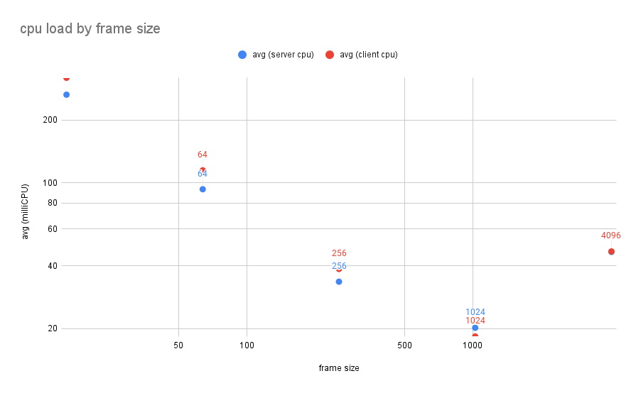
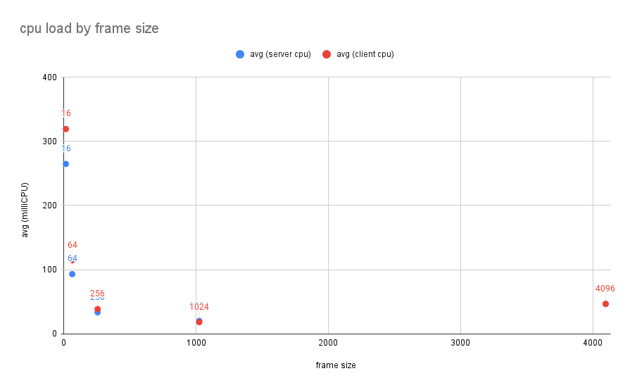

# 🧪 titrate

this is a load test to observe `linkerd2-proxy`'s performance when proxying
response streams that yield chunks of data at various sizes.

## 📝 start instructions

clone the [linkerd2][linkerd2] repo. from the root of that repository, run the
following commands to create a k3d cluster, build the docker images, load the
docker images into the cluster, and then install linkerd.

```shell
bin/k3d cluster create titrate \
  && bin/docker-build \
  && bin/image-load --k3d --cluster titrate \
  && bin/linkerd install --crds | kubectl apply -f - \
  && bin/linkerd install | kubectl apply -f -
```

from the root of *this* repository, run the following command to build the
docker images, and then import them into the k3d cluster.

```shell
just cluster-image-import
```

apply the client and server deployments to the cluster, by running
this command in the [linkerd2][linkerd2] respository, being sure to provide
the path to *this* respository's `k8s/` directory:

```shell
bin/linkerd inject <path/to/titrate/k8s/> | kubectl apply -f -
```

this will set up a number of client/server pairs. each group of clients will
send a 400rps load to their associated server. the servers emit a 4kb response
body in terms of 16, 64, 256, 1024, and 4096 byte chunks.

## 🫘 deployment

the YAML files in `k8s/` will yield a collection of pods like so:

```text
namespace: titrate

+=============+     yields 16-byte chunks     +=============+
| client-16   | <== ===================== ==> | server-16   |
+=============+                               +=============+
app=titrate-client                            app=titrate-server
frame-size=16                                 frame-size=16

+=============+     yields 64-byte chunks     +=============+
| client-64   | <== ===================== ==> | server-64   |
+=============+                               +=============+
app=titrate-client                            app=titrate-server
frame-size=64                                 frame-size=64

+=============+     yields 256-byte chunks    +=============+
| client-256  | <== ===================== ==> | server-256  |
+=============+                               +=============+
app=titrate-client                            app=titrate-server
frame-size=256                                frame-size=256

+=============+     yields 1024-byte chunks   +=============+
| client-1024 | <== ===================== ==> | server-1024 |
+=============+                               +=============+
app=titrate-client                            app=titrate-server
frame-size=1024                               frame-size=1024

+=============+     yields 4096-byte chunks   +=============+
| client-4096 | <== ===================== ==> | server-4096 |
+=============+                               +=============+
app=titrate-client                            app=titrate-server
frame-size=4096                               frame-size=4096
```

each response body is 16kb.

## 🔬 collecting data

once running, profile the pods by running the following script.

```shell
./record-cpu-usage.sh
```

this will run `kubectl top` at a regular interval to observe the cpu load being
used by proxy containers in the client and server pod(s) for each pair.

see `cpu-report.csv` once this is finished running, in approx. 2 minutes.

use your favorite spreadsheet program to pivot/chart this data.

## 🧐 results

the linkerd proxy uses an exponentially-higher amount of cpu when processing
response streams with pathologically small frame sizes, such as 16-byte chunks.

the benefits of a larger window size taper off after tuning it higher than
1Kib.



here is the same chart with linear x and y axes, for reference:



[linkerd2]: https://github.com/linkerd/linkerd2
